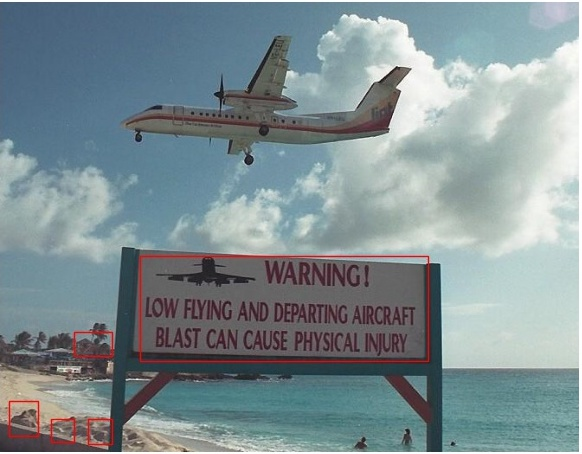
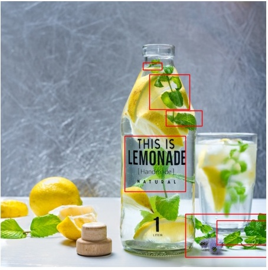

# text-detector (algorithm accuracy work in progress)
Locating texts in images using machine vision algorithms

This project aims to use only image processing techniques to locate text  
regions in the image. More detailed information about the approach is given this link  
https://muthu.co/?p=1367&preview=true

## Installation
pip install -r requirements.txt

## Usage
To understand the basic usage take a look at `demo.py` file

## Sample Results
| Original | Detected Text Regions |
|:----------------------------------------|:------------------------------------------------|
|  |  |
|  |  |
|  |  |
|  |  |
|  |  |

## Notebook
All my experiments are in this notebook also part of the project where I make changes to the algorithm and them move it to the detector file.
[Text Segmentation in Image.ipynb](notebooks/Text%20Segmentation%20in%20Image.ipynb)

## Accuracy
The accuracy depends a lot of the threshold parameters in the  
`utils.thresholds.py` file

## References
B. Epshtein, E. Ofek and Y. Wexler, "Detecting text in natural scenes with stroke width transform," 2010 IEEE Computer Society Conference on Computer Vision and Pattern Recognition, San Francisco, CA, 2010, pp. 2963-2970.

Tran, Tuan Anh Pham et al. “Separation of Text and Non-text in Document Layout Analysis using a Recursive Filter.” TIIS 9 (2015): 4072-4091.

Chen, Huizhong, et al. "Robust Text Detection in Natural Images with Edge-Enhanced Maximally Stable Extremal Regions." Image Processing (ICIP), 2011 18th IEEE International Conference on. IEEE, 2011.